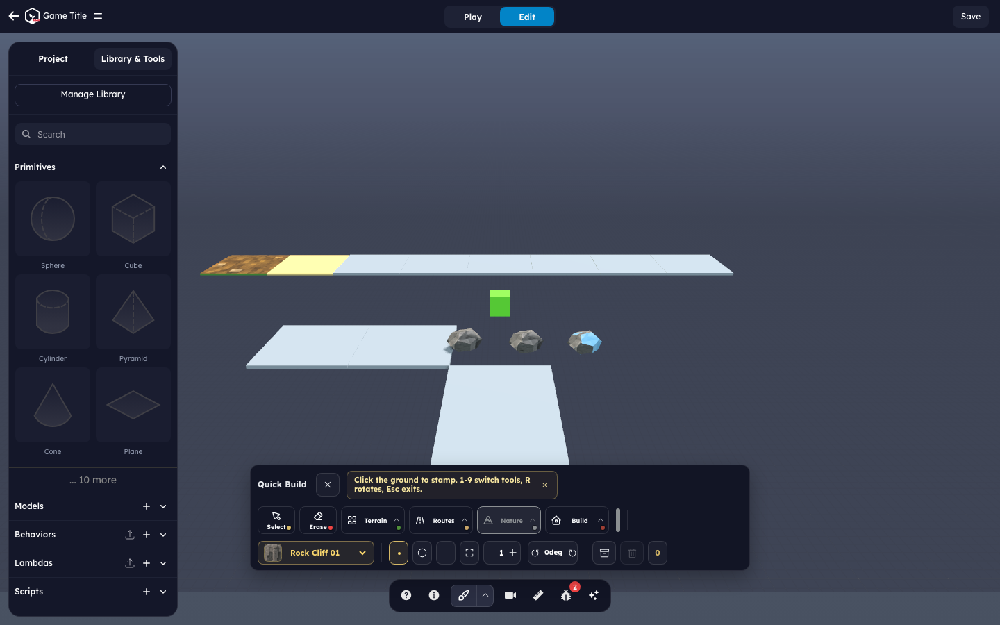
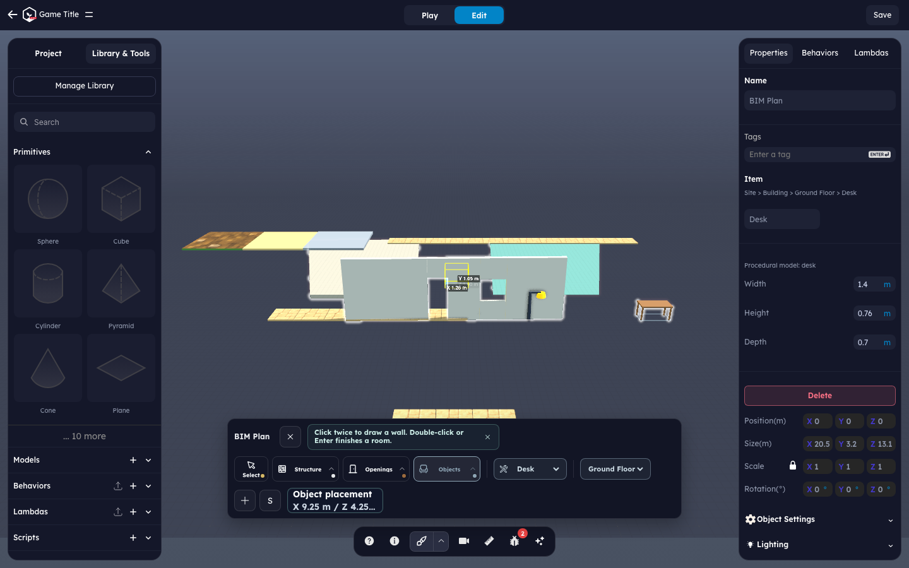

# StemStudio

> A browser-based 3D sandbox editor and runtime. Build, script, and play 3D games in your browser. Open source under MIT.

[](./LICENSE)
[](https://threejs.org)
[](https://bun.sh)

StemStudio is a local-first authoring environment: scene editing, JavaScript
behaviors, physics, multiplayer tooling, and an optional AI copilot. Projects
live in your browser (IndexedDB) or in a folder you pick (File System Access
API). No account or hosted project service is required.

> **Current deployment scope:** development and performance work target
> **Playground mode**. Playground scenes load and save through the local
> `ProjectStore`; the hosted/remote scene API mode is not deployed. Run the
> playground locally at `http://localhost:5173/playground` (or enter its editor
> shell directly at `/dashboard?mode=playground`). Remote gallery, publishing,
> collaboration, and share-link UI should not be treated as available features.

## Sponsor this project

If StemStudio is useful to you or your organization, please consider sponsoring its continued development. Sponsorships fund maintenance, new features, documentation, and community support.

[](https://github.com/sponsors/Stem-Studio)

---

## Features

- **3D scene editor** built on Three.js — primitives, materials, transforms, scene tree, viewport, gizmos.
- **Behaviors** — JavaScript classes attached to scene objects with a lifecycle (`init`, `update`, `onCollision`, etc.) and a built-in pack covering input, character controllers, vehicles, AI NPCs, UI, audio, and more.
- **Lambdas** — an entity-component system on top of behaviors when you need archetype-driven, batched work.
- **In-editor code editor** — Monaco for behavior and script authoring with full TypeScript-style assist.
- **Physics** — Ammo.js / Rapier integration with rigid bodies, joints, raycasting.
- **Local multiplayer** — an optional Colyseus sidecar for local testing.
- **AI copilot (BYOK)** — browser-direct providers in Playground mode, or the
  optional local Go proxy for development.
- **Local-first persistence** — debounced auto-save to IndexedDB, or
  `.stemscript.json` project files in a user-selected folder on Chromium.
- **Portable output** — download scene JSON from
  **Export Scene Source (.json)**, keep complete local project files in folder
  mode, or build the static application bundle.

## Quick start

For the Playground/editor workflow, install a current
[Bun](https://bun.sh) release and [Node.js](https://nodejs.org) 20.19+ or
22.12+ (the range required by Vite 8; the repository postinstall also uses
`npm`). The all-services workflow requires the Go version declared in
[`server/go.mod`](./server/go.mod). New machine? See
[Setting up your dev environment](#setting-up-your-dev-environment).

```bash
git clone https://github.com/Stem-Studio/Engine.git
cd Engine
bun install
bun run dev:editor
```

Open `http://localhost:5173/playground`. This is the current deployed product
path: projects remain local and scene reads/writes do not call a remote scene
service. Playground deliberately hides the first-run storage chooser and starts
with IndexedDB.

Optional local services are available for contributors working on AI or
multiplayer:

```bash
bun run dev       # Vite + local Go AI proxy + Colyseus sidecar
bun run dev:ai    # local Go AI proxy only
bun run dev:mp    # local Colyseus sidecar only
```

Outside Playground mode, the local dashboard can offer IndexedDB or a
user-selected folder. The folder option depends on Chromium's File System
Access API.

For the optional local AI proxy, start from the canonical environment template:

```bash
cp .env.example .env
```

Then set only the providers you intend to use. See
[BYOK setup](./docs/byok.md) for supported providers and the difference between
Playground's browser-direct path and the optional local proxy.

## Setting up your dev environment

The editor workflow needs **[Bun](https://bun.sh)** and
**[Node.js](https://nodejs.org) 20.19+ or 22.12+** with `npm`, matching Vite
8's engine range. Install **[Go](https://go.dev)** at the version declared in
`server/go.mod` only when you need the local AI proxy. Pick your OS below,
then continue with [Quick start](#quick-start).

### macOS

Using [Homebrew](https://brew.sh):

```bash
brew install oven-sh/bun/bun go node git
```

Or install each from its official site (links above). Apple Silicon and Intel are both supported.

### Linux

```bash
# Bun
curl -fsSL https://bun.sh/install | bash

# Node.js 20.19+ — via nvm (distro packages are often older)
curl -fsSL https://raw.githubusercontent.com/nvm-sh/nvm/v0.40.1/install.sh | bash
nvm install 20

# Go — match server/go.mod; distro `golang-go` may lag
#   https://go.dev/doc/install   (or: sudo apt install golang-go / sudo dnf install golang)

# Build essentials for any native dependency compilation
sudo apt install -y build-essential git    # Debian/Ubuntu
# sudo dnf groupinstall "Development Tools"  # Fedora/RHEL
```

Open a new shell (or `source ~/.bashrc`) so the freshly installed tools land on your `PATH`.

### Windows

**Use [WSL2](https://learn.microsoft.com/windows/wsl/install) (recommended).** Several project scripts use Unix-shell idioms and `.sh` deploy scripts that do not run under native `cmd`/PowerShell. WSL2 gives you a real Linux shell where everything works as documented.

```powershell
wsl --install            # installs Ubuntu; reboot if prompted
```

Then open the **Ubuntu** terminal and follow the **Linux** instructions above. Clone the repo _inside_ the WSL filesystem (e.g. `~/code/…`, not `/mnt/c/…`) for usable file-watch and build performance.

<details>
<summary>Native Windows (advanced, unsupported)</summary>

```powershell
winget install OpenJS.NodeJS.LTS GoLang.Go Git.Git
powershell -c "irm bun.sh/install.ps1 | iex"
```

You will still need to work around the Unix-style scripts, for example by running the editor, AI server, and multiplayer sidecar separately. WSL2 is strongly preferred.

</details>

### Verify

```bash
bun --version
go version        # must satisfy server/go.mod when running the AI proxy
node --version    # v20.19+ or v22.12+
```

If Bun and Node print versions, you're ready for the Playground workflow. Go
is required only for `bun run dev`, `bun run dev:ai`, and AI-server builds.

## What's in the box

- Playground/editor shell, player route, runtime, behaviors, lambdas, physics,
  rendering, scheduler, and asset loading.
- Monaco-based script/behavior editor.
- Local multiplayer Colyseus sidecar.
- AI proxy server (Go) that forwards calls to your provider keys.
- BYOK key management for Playground's browser-direct providers and the
  optional local AI proxy.
- Build tooling (Vite, TypeScript, ESLint, Bun test).
- Engine docs alongside the code: behaviors, lambdas/ECS, physics, UI, art specs.

## Documentation

- [Architecture overview](./docs/architecture.md) — the local Playground,
  editor/player entries, and optional development sidecars.
- [Scheduler & editor settings](./docs/scheduler-and-editor-settings.md) — frame scheduler architecture, quality presets, performance controls, and profiling tools.
- [Stem Script](./docs/stem-script.md) — the editor DSL, command-contract boundary, Script Tool mode, and `.stemscript` game imports.
- [Built-in behaviors](./docs/built-in-behaviors.md) — the behavior model, the full catalog, and how to attach or author one.
- [Lambdas (ECS layer)](./docs/lambdas.md) — batched, dependency-scheduled systems over many objects, with examples.
- [Import packs](./docs/import-packs.md) — curated reusable script modules (`noise`, `prng`, `uikit-dual-mode`) and the `@import` workflow.
- [Quick Build](./docs/quick-build.md) — builder stamps, brushes, texture packs, shortcuts, and smoke-test selectors.
- [BIM Plan](./docs/plan-cad.md) — Plan/CAD node model, persistence contract, interchange subset, and limitations.
- [Builder Studio release gate](./docs/builder-studio-release-gate.md) — launch configuration, beta exit criteria, and required checks.
- [BYOK setup](./docs/byok.md) — connect your AI provider keys.
- [Multiplayer guide](./docs/multiplayer.md) — local sidecar and self-hosted deployment.
- [Exporting a game](./docs/exporting-a-game.md) — current scene, project-file,
  and static-build export contracts.
- [Contributing](./CONTRIBUTING.md) — development workflow and PR guidelines.

Existing games in Stem Script format live in
[Stem-Studio/Games-StemScript](https://github.com/Stem-Studio/Games-StemScript).
Deeper engine docs (behaviors lifecycle, lambdas/ECS, physics, scheduler,
rendering) live under `docs/` in this repo.

## Builder Studio

Open the builder-first editor at `/create/project?builder=1`. The Build control
opens Quick Build by default, while Model (Mesh CAD) and Plan (BIM Plan) stay
behind the per-project **Enable CAD & BIM tools (beta)** setting.

The Builder Studio smoke tests capture the primary surfaces:





Regenerate these captures with `bun run test:e2e:builder-tools` while
`bun run dev:editor` is serving on `http://localhost:5173`. See
[Quick Build](./docs/quick-build.md), [BIM Plan](./docs/plan-cad.md), and the
[Builder Studio release gate](./docs/builder-studio-release-gate.md) for the
full production checklist.

## Development workflow

This project uses Bun as its package manager and task runner.

```bash
bun run dev:editor     # Current focus: Playground/editor on Vite
bun run dev            # Optional all-in-one: Vite + AI server + MP sidecar
bun run dev:ai         # AI server only
bun run dev:mp         # MP sidecar only

bun run build          # Production static build
bun run typecheck      # TypeScript verification
bun run test           # Unit + integration tests
bun run lint           # ESLint
```

The in-editor **Export Scene Source (.json)** action downloads the current
scene as JSON; it is not a one-click standalone-player packager. Folder mode
writes complete local project files as `.stemscript.json`, while `bun run
build` produces the static application bundle. See
[Exporting a game](./docs/exporting-a-game.md).

## Browser support

- **Primary performance target:** current Chromium browsers with WebGPU.
- **Compatibility path:** IndexedDB works without folder access, and projects
  expose a **Force WebGL** rendering setting for browsers or effects that need
  the fallback.
- **Folder-backed projects:** require the File System Access API and are
  therefore a Chromium-focused feature.
- **Mobile authoring:** the editor is landscape-only on mobile and narrow
  viewports. Portrait authoring is blocked by a rotate-device gate until the
  viewport is landscape. Player orientation is configured per project and can
  differ from the editor.

Firefox and Safari are not currently claimed as full-feature parity targets;
verify the exact browser and renderer combination for release-critical work.

## Team

|  [<br><sub><b>papiguy</b></sub>](https://github.com/papiguy)   |       [<br><sub><b>mvromanov</b></sub>](https://github.com/mvromanov)       |       [<br><sub><b>fayd404</b></sub>](https://github.com/fayd404)       |        [<br><sub><b>ikerr</b></sub>](https://github.com/ikerr)         |
| :------------------------------------------------------------------------------------------------------------------: | :---------------------------------------------------------------------------------------------------------------------------------: | :---------------------------------------------------------------------------------------------------------------------------: | :------------------------------------------------------------------------------------------------------------------------: |
|                                                  CTO & Venture Lead                                                  |                                                         Head of Engineering                                                         |                                                        Head of Product                                                        |                                                     Platform & Physics                                                     |
| [<br><sub><b>querielo</b></sub>](https://github.com/querielo) | [<br><sub><b>AndreiRudenko</b></sub>](https://github.com/AndreiRudenko) | [<br><sub><b>gajendra906</b></sub>](https://github.com/gajendra906) | [<br><sub><b>nafeezable</b></sub>](https://github.com/nafeezable) |
|                                                   Three.js Wizard                                                    |                                                                Games                                                                |                                                              QA                                                               |                                                         Community                                                          |
|  [<br><sub><b>JNicoSD</b></sub>](https://github.com/JNicoSD)   |            [<br><sub><b>Jan</b></sub>](https://github.com/janvher)            |   [<br><sub><b>Anand</b></sub>](https://github.com/kumaranand48)   |                                                                                                                            |
|                                                        Games                                                         |                                                                Games                                                                |                                                          Head of SRE                                                          |                                                                                                                            |

## Contributing

We welcome contributions. Please read [CONTRIBUTING.md](./CONTRIBUTING.md) before opening a PR.

Bug reports, feature requests, and discussions: [GitHub Issues](https://github.com/Stem-Studio/Engine/issues).

You can sponsor us via [GitHub Sponsors](https://github.com/sponsors/Stem-Studio). Every contribution, large or small, is appreciated.

## License

[MIT](./LICENSE). See [THIRD-PARTY-NOTICES.md](./THIRD-PARTY-NOTICES.md) for the licenses of bundled dependencies.

## Security

Found a vulnerability? Please don't open a public issue. See [SECURITY.md](./SECURITY.md) for private disclosure.

## Acknowledgements

Built on [Three.js](https://threejs.org), [React](https://react.dev), [Vite](https://vitejs.dev), [Colyseus](https://colyseus.io), [Monaco Editor](https://microsoft.github.io/monaco-editor/), [Ammo.js](https://github.com/kripken/ammo.js), [Rapier](https://rapier.rs), and [Bun](https://bun.sh).
